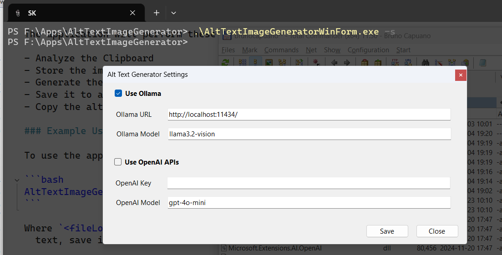

[](/LICENSE)
[](https://twitter.com/elbruno)


[](https://github.com/elbruno/Image-AltText-Generator-Ollama/actions/workflows/dotnet-desktop.yml)

## Description

**AltTextImageGeneratorWinForm** is a Windows application designed to generate alt text descriptions for images. This tool is particularly useful for creating image descriptions for applications like X/Twitter, BlueSky, LinkedIm, PowerPoint, and other platforms where alt text is needed to improve accessibility. 

The application processes an image file, generates a descriptive alt text, and saves it to a text file. Additionally, it copies the generated alt text to the clipboard for easy pasting.

The application uses a LLM to generate the Alt-Text. The model can be running locally using ollama or using a paid service like OpenAI APIs. 


## Requirements

- [.NET 9.0 SDK](https://dotnet.microsoft.com/download/dotnet/9.0) or later
- Option 1: Using Ollama with the a vision model, like Llama3.2-vision
  - [Ollama](https://ollama.com/) installed locally
  - [Llama3.2-vision model](https://ollama.com/library/llama3.2-vision) downloaded and configured in Ollama
- Option 2: Using OpenAI and gpt-4o or gpt-4o-mini to analyze the image
  - [OpenAI](https://platform.openai.com/) account with API access and credit
  - ***Important:** this option requires to pay for the OpenAI API usage*
  
### Installing .NET 9.0 SDK

You can download and install the .NET 9.0 SDK from the official [.NET website](https://dotnet.microsoft.com/download/dotnet/9.0).

### Installing Ollama

To install Ollama, follow the instructions provided on the [Ollama website](https://ollama.com/).

### Downloading the Llama3.2-vision Model

After installing Ollama, download the [Llama3.2-vision model](https://ollama.com/library/llama3.2-vision) by following the instructions on the Ollama website or using the Ollama CLI.

## Running the app

The following scenarios are supported by the application.

- Using Ollama with a local vision model to analyze the image
- Using OpenAI and gpt-4o or gpt-4o-mini to analyze the image

### Example Usage with images in the Clipboard

If you have copied an image to the clipboard, just run the **AltTextImageGenerator** application

The application will perform these steps:

- Analyze the Clipboard
- Store the image in this folder: current application location + "images" folder
- Generate the alt text
- Save it to a text file with the same name as the image file
- Copy the alt text to the clipboard.

### Example Usage with existing images

To use the application, run the following command in the terminal:

```bash
AltTextImageGenerator <fileLocation> 
```

Where `<fileLocation>` is the path to the image file you want to process. The application will generate the alt text, save it to a text file with the same name as the image file, and copy the alt text to the clipboard.

### Registering the Application in Windows

To register the application and add a new right click meu to windows, run the following command in the terminal:

```bash
AltTextImageGenerator -r
```

### Settings of the application

To edit the application settings you must run the following command in the terminal:

```bash
AltTextImageGenerator -s
```

This will show the settings dialog, where you can configure the following settings:

- Use Ollama
  -	Ollama Url and Ollama vision model
- Use OpenAI
  - OpenAI Key and OpenAI model



## Detailed Description of the Functionality

The main functionality of the AltTextImageGeneratorWinForm application is implemented in the `Program.cs` file. Below is a detailed description of its key components:

1. **Main Entry Point**:
   - The `Main` method initializes the application with high DPI mode, visual styles, and compatible text rendering.
   - It checks for command-line arguments to determine the image file location or display help information.
   - If a valid image file location is provided, it generates the alt text for the image, saves it to a text file, and copies the alt text to the clipboard.

2. **ShowHelp Method**:
   - Displays usage information and options for the application.

3. **GenerateAltTextForImageAsync Method**:
   - Uses the OllamaChatClient to communicate with the Llama3.2-vision model.
   - Sends the image file to the model and requests an alt text description.
   - Returns the generated alt text.

4. **GetMediaType Method**:
   - Determines the media type of the image based on its file extension.
   - Supports JPEG, PNG, and GIF formats.

### Error Handling

The application includes basic error handling to display error messages in case of exceptions, such as unsupported file formats or issues with the Ollama service.

By using AltTextImageGeneratorWinForm, you can quickly and easily generate descriptive alt text for your images, enhancing accessibility and usability in various applications.

## Resources

- [.NET 9.0 SDK](https://dotnet.microsoft.com/download/dotnet/9.0)
- [Ollama](https://ollama.com/)
- [Llama3.2-vision model](https://ollama.com/library/llama3.2-vision)

The app uses this packages to work with the Clipboard

- [Clowd.Clipboard](https://github.com/clowd/Clowd.Clipboard)

- [TextCopy](https://github.com/CopyText/TextCopy)

### Video Recordings

Coming Soon!